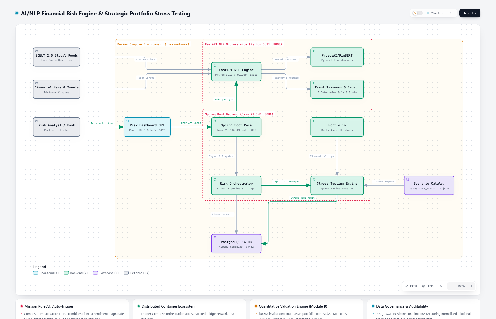

# AI/NLP Financial Risk Engine & Strategic Portfolio Stress Testing - S&P Global & Crisil Campus Hackathon

**Candidate Name:** Mritunjay Senapati  
**College Email ID:** b224030@iiit-bh.ac.in  
**College / Campus:** IIIT Bhubaneswar  
**Demo Video Link:** _TODO: add YouTube (Unlisted) link_  
**Slide Deck Link (if hosted externally):** Included in repository — [View PDF](docs/presentation.pdf) If Not render then ([Direct / Raw Link](https://raw.githubusercontent.com/Mritunjay28/iiit-bhubaneswar-mritunjay-senapati-hackathon/main/docs/presentation.pdf)) · [Slide Gallery](docs/SLIDES.md) · [PowerPoint (.pptx)](docs/presentation.pptx)

---

## 1. Project Overview / Problem Statement & Approach

Credit desks, rating analysts and portfolio managers react to market-moving news such as sanctions, rate decisions and defaults. Traditional stress testing runs in monthly or quarterly batches, so there is a gap between when news breaks and when its impact on a portfolio is measured. Analysts also can't manually triage thousands of headlines and social posts to decide which ones matter.

This prototype closes that gap with an event-driven pipeline (Module B). A Python NLP service ingests financial text (live GDELT DOC 2.0 news with a local fallback, plus a tweet dataset). It scores sentiment from `-1.0` to `+1.0` with `ProsusAI/finbert`, classifies each item into one of 7 financial event types, and computes an explainable 1–10 **Impact Score**.

A Spring Boot orchestrator stores every signal. When a signal reaches **Impact ≥ 7 (Rule A1)**, it automatically runs a stress test on a synthetic **$585M multi-asset portfolio** (bonds, loans, equities, derivatives). Results include per-asset P&L, asset-class and sector attribution, VaR 95/99 and the worst-hit position. They are persisted to PostgreSQL as an audit trail and shown in a React dashboard.

---

## 2. Architecture & Tech Stack



### Data flow
1. **Ingest** — The analyst (via the dashboard) or a fetch job sends text to the Spring Boot API (`POST /api/signals/ingest`, `/fetch/gdelt`, `/fetch/tweets`).
2. **Analyze** — Spring Boot calls the FastAPI NLP service (`POST /analyze`) over WebClient. The NLP service returns sentiment, event type, confidence and impact score.
3. **Persist** — The `RiskSignal` is stored in PostgreSQL.
4. **Trigger (Rule A1)** — If `impactScore >= 7`, the Risk Orchestrator calls the Stress Testing Engine with the scenario mapped to that event type (from `data/shock_scenarios.json`).
5. **Stress & audit** — The engine shocks all 15 holdings and writes a `StressTestResult` plus per-asset `StressTestAssetDetail` rows (the stress test audit trail).
6. **Visualize** — The React dashboard shows signals, the portfolio, waterfall/impact charts and the stress test history.

### Services (Docker Compose, `risk-network` bridge)

| Service | Tech | Port |
|---|---|---|
| `frontend` | React 19, Vite 8, Recharts 3, React Router 7, Lucide icons, vanilla CSS; served by Nginx | 5173 |
| `backend` | Java 21, Spring Boot 3.3.4, Spring Data JPA, Spring WebFlux `WebClient`, Actuator, HikariCP | 8080 |
| `nlp-service` | Python 3.11, FastAPI, HuggingFace Transformers (`ProsusAI/finbert`), PyTorch, Pandas | 8000 |
| `postgres` | PostgreSQL 16 (Alpine) | 5432 |

H2 (in-memory) is used for the backend `dev` profile and for tests.

### Main REST endpoints

| Service | Endpoint | Purpose |
|---|---|---|
| Backend | `POST /api/signals/ingest`, `POST /api/signals/ingest/batch` | Analyze + store text, auto-trigger Rule A1 |
| Backend | `POST /api/signals/fetch/gdelt`, `POST /api/signals/fetch/tweets` | Pull and process news / tweets |
| Backend | `GET /api/signals`, `/latest`, `/stats` | Signal feed and statistics |
| Backend | `GET /api/portfolio`, `/summary`; `POST /api/portfolio/reset` | Portfolio holdings and summary |
| Backend | `POST /api/stress-tests/run`; `GET /api/stress-tests`, `/latest`, `/scenarios` | Manual stress tests, history, scenarios |
| Backend | `GET /api/system/status` | Cluster status |
| NLP | `POST /analyze`, `POST /analyze/batch`, `GET /health` | Sentiment, classification, impact |

---

## 3. Dataset Used

All data is **synthetic or publicly available**. No proprietary or client data is used. Everything is in [`data/`](data/):

| File | Nature | Contents |
|---|---|---|
| `synthetic_portfolio.json` | Synthetic | 15 holdings, **$585M** notional: Bonds $220M (US Treasury 10Y $100M, D=8.2; UK Gilt 5Y $45M; Apple 5Y $30M; Brazil Sovereign $25M; India Govt 7Y $20M), Loans $110M (Goldman Sachs $60M, JPMorgan $50M), Equities $75M (REIT ETF $22M, Tesla $20M, Microsoft $18M, NVIDIA $15M), Derivatives $180M (S&P 500 Futures $75M, EUR/USD Forward $40M, Crude Oil Swap $35M, Deutsche Bank CDS $30M). Names are illustrative only. |
| `shock_scenarios.json` | Synthetic, hand-calibrated | 7 scenarios, one per event type, each with equity, rate, credit-spread, FX and commodity shocks |
| `sample_news.json` | Synthetic headlines | 7 curated headlines, one per event type, with expected event/impact. Used as the offline fallback when the live GDELT DOC 2.0 API (public) is unreachable |
| `sample_tweets.csv` | Synthetic | 8 finance tweets in a Kaggle-style schema (`tweet_id, timestamp, ticker, text, retweet_count, like_count`) |

### Assumptions & design decisions

| # | Assumption | Rationale |
|:---:|---|---|
| **A1** | Auto-trigger a stress test when `impactScore >= 7` | Only high-severity signals cause automatic action, which limits noise |
| **A2** | Impact Score is an integer 1–10: `clamp(round((0.35·abs(sentiment) + 0.35·severity + 0.30·source_weight) × 10), 1, 10)` | Explainable multi-factor formula: 35% sentiment magnitude, 35% event severity, 30% source credibility. Severity weights: Geopolitical 0.90, Credit 0.85, Macro 0.80, Regulatory 0.60, M&A 0.50, Earnings 0.40, Product 0.30. Modulated by model confidence factor `(0.85 + 0.15·confidence)` when available. |
| **A3** | Sentiment = `P(positive) − P(negative)` in `[-1, +1]` | Standard FinBERT output. A financial-lexicon fallback is used if the model can't be loaded (e.g. offline) |
| **A4** | Valuation is notional-based | Keeps scope manageable while preserving portfolio-level attribution |
| **A5** | 7 predefined scenarios mapped 1:1 to event types | Deterministic, reproducible results; custom shocks are possible via `POST /api/stress-tests/run` |
| **A6** | Bonds: `−D·Δr − D·Δspread + ½·C·Δr²` with `C ≈ D²/2` | Duration plus spread with an approximate convexity term |
| **A7** | Loans: `−Δspread × 3.2y tenor − 1.5% per 100bps` migration buffer. Equities: equity shock × sector beta (Tech 1.3, Auto 1.4, Banking 1.2, REIT 1.25 + 5·Δr). Derivatives: pass-through of the relevant risk factor | Simple, transparent factor model |
| **A8** | Source credibility: GDELT/news 1.0, custom 0.8, tweets 0.7 | Penalizes noisier social sources |
| **A9** | FinBERT input truncated to 512 tokens | Model limit; avoids out-of-memory errors |

---

## 4. Quickstart & Installation

**Runtime:** Docker + Docker Compose (recommended), or Java 21, Node 20+ and Python 3.11 for local runs.  
**OS tested:** Windows 11.

### Option A — Docker Compose (recommended)
```bash
git clone https://github.com/Mritunjay28/iiit-bhubaneswar-mritunjay-senapati-hackathon.git
cd iiit-bhubaneswar-mritunjay-senapati-hackathon
docker compose up --build
```
- Dashboard: http://localhost:5173
- Backend API: http://localhost:8080/api (health: `/actuator/health`)
- NLP service + Swagger: http://localhost:8000/docs
- PostgreSQL: `localhost:5432` (db `riskengine`, user `admin`, password `admin123` — local demo credentials only)

The first build downloads the FinBERT model (~440 MB), so it takes a few minutes.

### Option B — Run services locally
```bash
# 1. NLP service
cd src/nlp-service
pip install -r requirements.txt
uvicorn app.main:app --host 0.0.0.0 --port 8000

# 2. Backend (H2 dev profile, no Postgres needed) — new terminal
cd src/backend
./mvnw spring-boot:run -Dspring-boot.run.profiles=dev      # Windows: mvnw.cmd ...

# 3. Frontend — new terminal
cd src/frontend
npm install
npm run dev
```

### Tests
```bash
cd src/backend && ./mvnw test          # 17 JUnit unit/integration tests (H2)
cd src/nlp-service && python test_nlp.py   # classifier, impact score, lexicon sentiment
python test_e2e_pipeline.py            # end-to-end smoke test against a running stack
```

---

## 5. Key Results & Domain Impact

### Stress test output on the $585M portfolio
The engine is deterministic. These figures come from the formulas in `StressTestEngineService` applied to `data/synthetic_portfolio.json` and `data/shock_scenarios.json`:

| Scenario (event type) | Portfolio P&L | Drawdown | Post-shock value | Largest asset-class loss | Worst-hit holding |
|---|:---:|:---:|:---:|---|---|
| Credit Crunch & Default Cascade (`CREDIT_EVENT`) | **−$93.14M** | **−15.92%** | $491.86M | Bonds −$49.84M | US Treasury 10Y −$28.53M |
| Macro Downturn & Rate Hike (`MACROECONOMIC`) | **−$65.01M** | **−11.11%** | $519.99M | Bonds −$41.94M | US Treasury 10Y −$23.93M |
| Geopolitical Crisis (`GEOPOLITICAL`) | **−$55.44M** | **−9.48%** | $529.56M | Bonds −$28.56M | US Treasury 10Y −$16.36M |
| Regulatory Crackdown (`REGULATORY`) | **−$25.71M** | **−4.40%** | $559.29M | Bonds −$10.73M | US Treasury 10Y −$6.15M |
| M&A Market Disruption (`MERGER_ACQUISITION`) | **−$14.94M** | **−2.55%** | $570.06M | Bonds −$7.16M | US Treasury 10Y −$4.10M |
| Corporate Earnings Shock (`EARNINGS`) | **−$14.51M** | **−2.48%** | $570.49M | Equities −$4.92M | S&P 500 Futures −$3.75M |
| Product Disruption & Market Shift (`PRODUCT_LAUNCH`) | **−$7.36M** | **−1.26%** | $577.64M | Bonds −$2.86M | US Treasury 10Y −$1.64M |

Each run also returns VaR 95/99, sector P&L and a per-asset breakdown, all stored in the audit history.

### Compared with a naive approach
- **Batch vs. event-driven:** A periodic batch stress test only shows impact at the next run. Here a qualifying headline triggers a stress test as soon as it is ingested.
- **Manual triage vs. scoring:** Instead of analysts reading every item, each signal gets a reproducible 1–10 score. Only `≥ 7` triggers action.

### Why it matters
- **Credit and rating surveillance:** Flags default, downgrade and sanction headlines early, with transparent, explainable scores.
- **Portfolio risk:** Immediately shows which positions and asset classes drive the loss (for example, duration risk in the 10Y Treasury), so hedging decisions can be made faster.
- **Governance:** Every signal and stress run is stored with inputs and outputs, which supports audit and model review.

### Limitations & next steps
First-order factor model with approximate convexity; static, hand-calibrated scenarios; notional valuation; English text only. Next steps: Monte Carlo / historical-simulation VaR, live market data for mark-to-market, entity linking to holdings, and streaming ingestion (e.g. Kafka).
