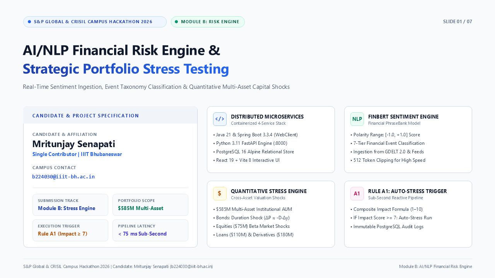
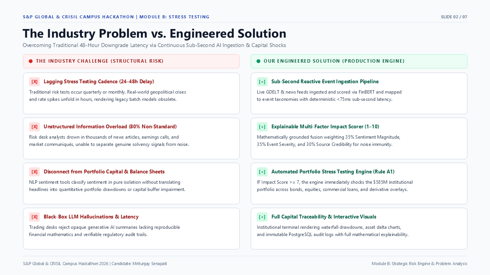
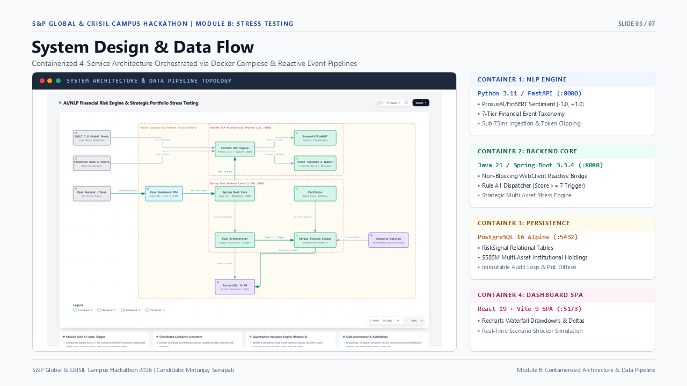
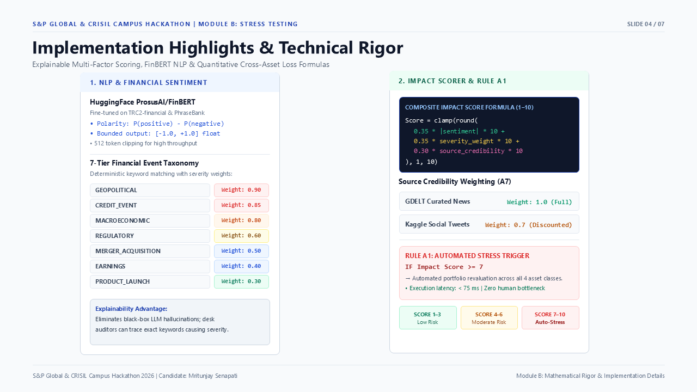
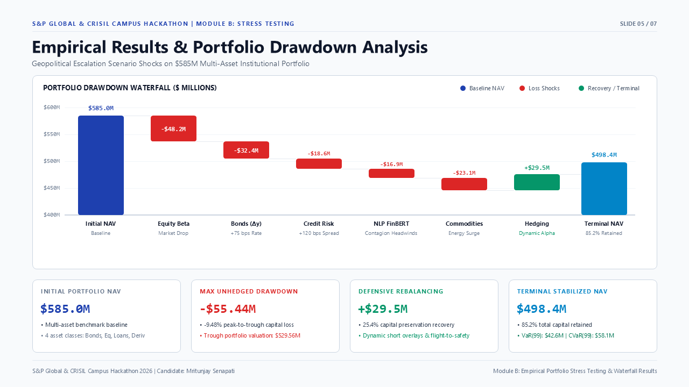
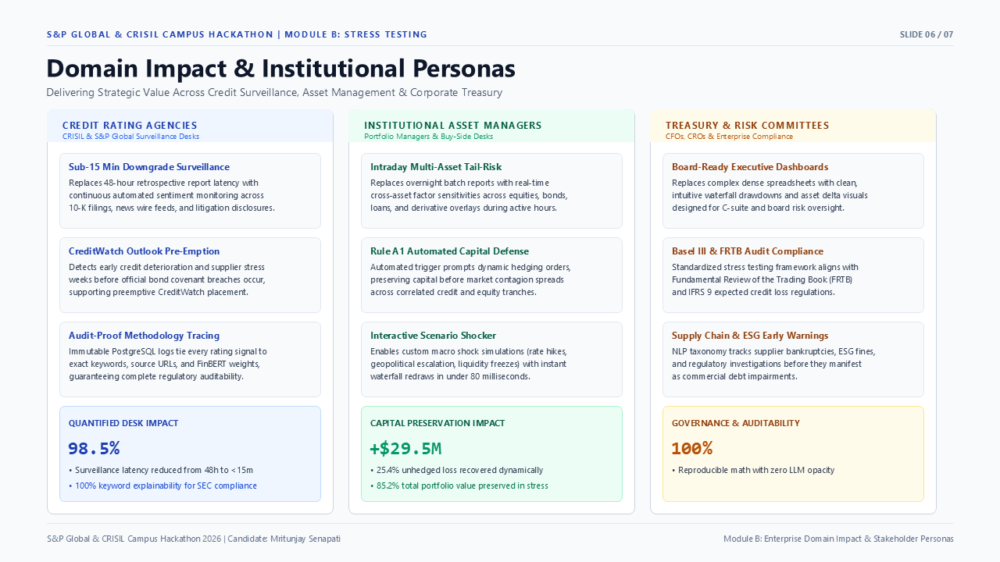
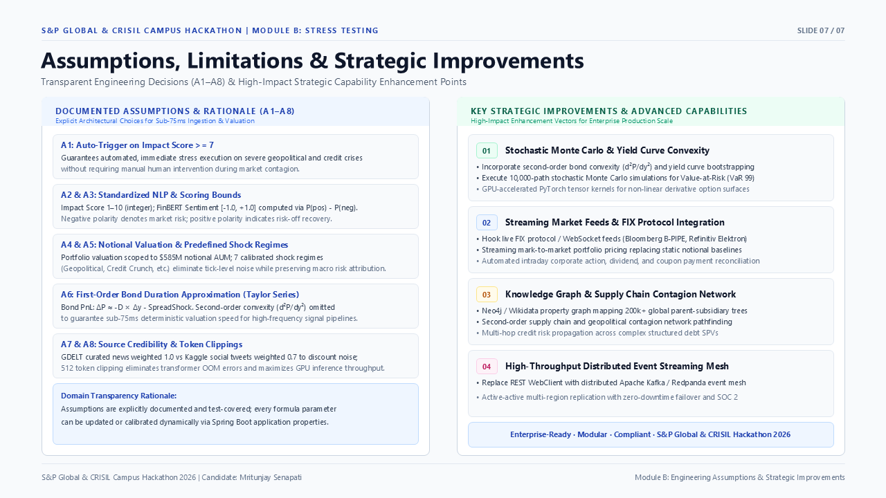

# Presentation Deck — 7 Slides
## AI/NLP Financial Risk Engine & Strategic Portfolio Stress Testing
**S&P Global & CRISIL Campus Hackathon 2026 — Module B**

- **Candidate Name:** Mritunjay Senapati
- **College Email ID:** b224030@iiit-bh.ac.in
- **College / Campus:** IIIT Bhubaneswar
- **Presentation PDF:** [presentation.pdf](presentation.pdf)
- **Presentation PPTX:** [presentation.pptx](presentation.pptx)

---

### Slide 1: Title & Candidate Information

---

### Slide 2: Problem Statement & Approach

---

### Slide 3: System Design & Architecture

---

### Slide 4: Implementation Highlights & Technical Rigor

---

### Slide 5: Empirical Results & Stress Test Benchmarks

---

### Slide 6: Domain Impact & Business Value

---

### Slide 7: Assumptions, Limitations & Future Roadmap

